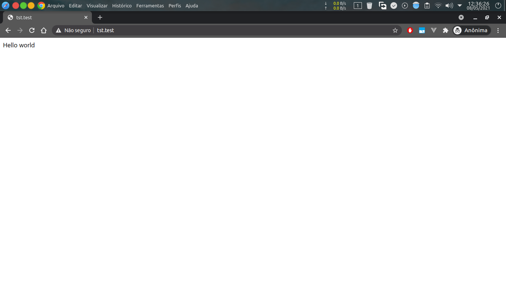
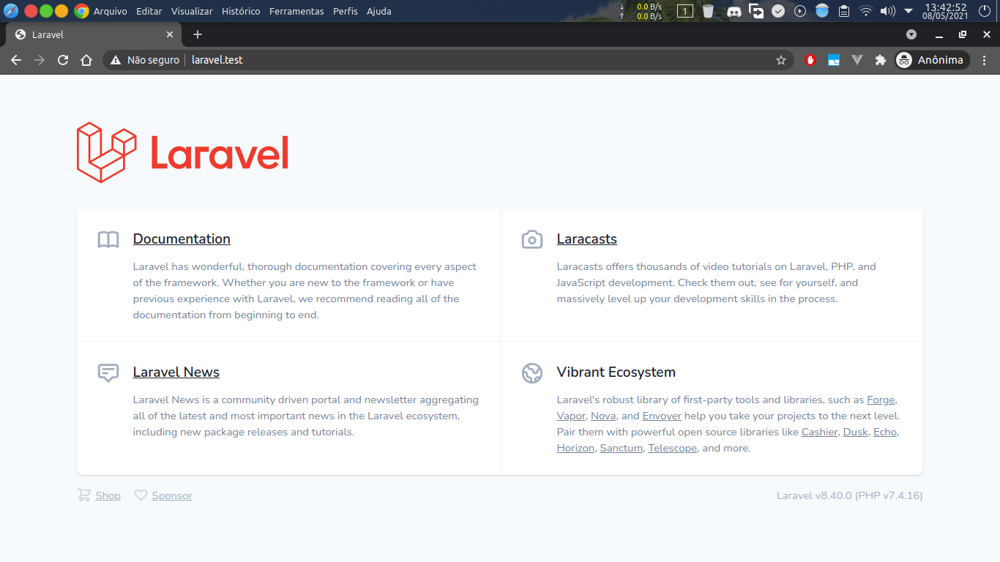

# Manual de configuração do ambiente WEB

## Sumário

1. [Introdução](#introdução)
    - [O que é](#o-que-é)
2. [Instalar o Docker e o Docker Compose](#instalar-o-docker-e-o-docker-compose)
    - [Windows](#windows)
    - [Linux](#linux)
3. [Clonar o Laradock](#clonar-o-laradock)
4. [Executar os containers](#executar-os-containers)
5. [Criar o projeto e o banco de dados](#criar-projeto-e-o-banco-de-dados)
   - [Criar um banco de dados pelo phpMyAdmin](#criar-um-banco-de-dados-pelo-php-my-admin)
   - [Criar o projeto](#criar-o-projeto)
     - [Projeto PHP simples](#projeto-php-simples)
     - [Criar um projeto **Laravel**](#criar-um-projeto-laravel)
   - [Criar um virtual host Apache do projeto](#criar-um-virtual-host-apache-do-projeto)
6. [Criar um repositório Git](#criar-um-repositório-git)
7. [Recomendações](#recomendações)
8. [Referências](#referências)
9. [Sobre](#sobre)

## Introdução

Gerenciar um ambiente de desenvolvimento pode ser algo trabalhoso e frustrante se tentarmos fazer manualmente, principalmente em projetos realizados em equipe. Felizmente existe uma série de ferramentas, metodologias e boas práticas para nos auxiliar nesta complexa tarefa. As aplicações da WEB moderna precisam serem colocadas no ar e forma rapida e segura. Seguindo o guia criado pelo [Heroku](https://www.heroku.com/), o [12FactorApp](https://12factor.net/pt_br/), podemos nos orientar na execução dessa atividade cumprindo seus "fatores". Com o Docker facilmente podemos alcançar os <span style="color:cyan">_fatores_ do II, ao XI,</span>.

### O que é:

- **Container**

Um _container_ é uma tecnologia que permite empacotar um software e todas as suas dependências para que o aplicativo seja executado de forma rápida e confiável. Dessa forma fica mais fácil migrá-las de um ambiente para outro (desenvolvimento, teste, produção etc.) sem perder funcionalidades.

- **Docker:**

    Docker pode significar várias coisas.

    - Empresa por trás da tecnologia;
    - A comunidade _open source_ por trás da tecnologia;
    - O _software Docker_, que é uma tecnologia de conteinerização para criação e uso de containers Linux.

- **Docker Compose:**

    É um utilitário de linha de comando que tem a função de ser o orquestrador de containeres do Docker. Ele basicamente simplifica e agiliza o manuseio do containers.

- **Recursos do container Docker**

  Um container basicamente é uma instância de uma imagem (arquivo template). Esta instância é totalmente descartável. Caso ocorra um problema com o container é muito facil de se livrar dele "derrubando-o" e "levantando" outro container a partir da mesma imagem.

  + Volumes:

    São uma espécie de pasta compartilhada/espelhada entre containers ou com a maquina real. Por exemplo um container de um banco de dados geralmente vai ter um volume para salvar e compartilhar a pasta onde a base de dados é salva. Assim pode se garantir que os dados não serão apagos caso ocorra algum problema com o container.

  + Ligamento de portas (_Binding Ports_)

    Geralmente um container irá executar um serviço que estará ouvindo em uma certa porta. É de suma importancia compartilhar esse serviço com a maquina real por exemplo podemos fazer um "bind" da porta 3306 do container do MySQL com uma porta qualquer no "lado de fora" na maquina real.

> <span style="color:#00dcff">INFO:</span> Recomendação de dois videos bem didáticos sobre sobre [Docker](https://youtu.be/hCMcQfGb4cA) e sobre o [Docker Compose](https://youtu.be/kHqxQaxitZk).

- **Laradock:**

  Laradock, como próprio site oficial diz, é um ambiente de desenvolvimento PHP completo para Docker. Ele oferece suporte a uma variedade de serviços comuns, todos pré-configurados para fornecer um ambiente de desenvolvimento de PHP pronto.

  O Laradock fornece mais de 70 serviços entre eles os principais bancos de dados, por exemplo <span style="color:cyan">o MySQL, PostgresSQL</span>, Redis, MariaDB, Mongo, Cassandra e entre outros. Os dois principais servidores de paginas WEB compatíveis com o PHP, o Apache2 e o Nginx. Além de um container especial, chamado _workspace_, que fornece o executável do <span style="color:cyan">PHP</span> nas versões: <span style="color:cyan">8.0, 7.4, 7.3, 7.2, 7.1, 7.0, 5.6</span>. Também o Composer, NodeJS(com o npm), o Python e Pyhton3. As _shells_ _bash_ e o _zsh_(até com o plugin _oh-my-zsh_). [Saiba mais.](https://laradock.io/)

- **Composer:**

    Composer é uma ferramenta para gerenciamento de dependências em PHP. Ele permite que você declare as bibliotecas das quais seu projeto depende e as gerenciará (instalará/atualizará) para você. [Saiba mais.](https://getcomposer.org/doc/00-intro.md#dependency-management)

> <span style="color:orange">OBS:</span> Não confundir o **Composer** com **Docker Compose**, são duas ferramentas totalmente diferentes. 

## Instalar o Docker e o Docker Compose

### Windows

Para instalar no Windows é necessário ativar o **WSL2** ou _Windows Subsystem for Linux version 2_ [veja mais](https://docs.microsoft.com/pt-br/windows/wsl/about). Em seguida será preciso instalar uma _distribuição Linux_ por meio da _Windows Store_, de preferência o **Ubuntu**. Após a intalação e configuração da distribuição Linux no WLS basta serguir os passo aqui abaixo da instalação no [ambiente Linux.](#linux)

### Linux

Passo a passo em distribuições Debian e derivados(Ubuntu e Linux Mint).

Atualize os pacotes do sistema e instale pacotes necessários para a instalação do Docker.

```bash
$ sudo apt-get update
$ sudo apt-get install \
    apt-transport-https \
    ca-certificates \
    curl \
    gnupg \
    lsb-release
```

Seguidamente adicione o repositório do Docker.

```bash
$ curl -fsSL https://download.docker.com/linux/debian/gpg | sudo gpg --dearmor -o /usr/share/keyrings/docker-archive-keyring.gpg
```

Agora atualize novamente e instale e finalmente instale o Docker.

```bash
$ sudo apt-get update
$ sudo apt-get install docker-ce docker-ce-cli containerd.io
```

Agora instale o orquestrador de containers do Docker o **Docker Compose**.

```bash
$ sudo curl -L "https://github.com/docker/compose/releases/download/1.29.1/docker-compose-$(uname -s)-$(uname -m)" -o /usr/local/bin/docker-compose
$ sudo chmod +x /usr/local/bin/docker-compose
```

Caso queira executar o Docker e o Docker Compose sem o _sudo_, caso não exista crie um grupo chamado _docker_ e adicione seu usuário nele. Em seguida faça logout e login novamente para atualizar os grupos do Linux. [Mais informações.](https://docs.docker.com/engine/install/linux-postinstall/)

```bash
$ sudo groupadd docker # cria grupo docker
$ sudo usermod -aG docker $USER # adiona seu usuário no grupo docker
$ newgrp docker # ativar as alterações nos grupos
```

## Clonar o Laradock

```bash
$ cd ~/Documentos/projetos  #recomendo criar uma pasta projetos para ficar mais organizado
$ git clone https://github.com/Laradock/laradock.git
```

A arquitetura das pastas ficará com algo parecido com isso:

```txt
~/Documentos/projetos/
                      - laradock/
                          * mysql
                          * postgres
                          * phpmyadmin
                          * worksapce
                          * ...
                      - projeto-1
                      - projeto-2
                      - ...
```

O Laradock irá criar um volume ligando a pasta _/var/www_ dos containers com a pasta pai do Laradock na maquina real, no nosso exemplo a pasta _~/Documents/projetos_.

## Executar os containers

Entre na pasta do laradock, copie o arquivo .env-example para .env e edit o arquivo .env e altere a variável **MYSQL_VERSION** de _latest_ para _5.7_.

><span style="color:#00dcff">INFO:</span> Caso você deseje mudar a versão do _PHP_, basta alterar a variável **PHP_VERSION**.

```bash
$ cd ./laradock
$ cp .env-example .env
$ vim .env
```

> <span style="color:#00dcff">INFO:</span> No arquivo _.env_ a seção **MYSQL** possui o nome do usuário padrão com sua senha e também a senha do usuário root. Essas informações serão úteis logo abaixo.

Agora suba os containers dos seguintes serviços: mysql, phpmyadmin, apache2 e workspace.

```bash
$ docker-compose up -d mysql phpmyadmin workspace apache2
```

> <span style="color:orange">OBS: </span>Este comando irá demorar um pouco, pois o Docker precisará baixar e montar as imagens.

> <span style="color:orange">OBS: </span>Lembre-se de executar o Docker Compose sempre dentro da pasta do Laradock. Pois ele executa as operações com base no arquivo _docker-compose.yml_.

> <span style="color:cyan">DICA:</span> Caso ocorra algum erro durante a execução do comando, tente executar o comando mais uma vez.

Agora verifique se os containers estão rodando corretamente.

```bash
$ docker-compose ps
```

A saída tem que ser algo parecido com isso:

```text
           Name                          Command               State                                       Ports
----------------------------------------------------------------------------------------------------------------------------------------------------
laradock_apache2_1            /opt/docker/bin/entrypoint ...   Up      0.0.0.0:443->443/tcp,:::443->443/tcp, 0.0.0.0:80->80/tcp,:::80->80/tcp
laradock_docker-in-docker_1   dockerd-entrypoint.sh            Up      2375/tcp, 2376/tcp
laradock_mysql_1              docker-entrypoint.sh mysqld      Up      0.0.0.0:3306->3306/tcp,:::3306->3306/tcp, 33060/tcp
laradock_php-fpm_1            docker-php-entrypoint php-fpm    Up      9000/tcp, 0.0.0.0:9003->9003/tcp,:::9003->9003/tcp
laradock_phpmyadmin_1         /docker-entrypoint.sh apac ...   Up      0.0.0.0:8081->80/tcp,:::8081->80/tcp
laradock_workspace_1          /sbin/my_init                    Up      0.0.0.0:2222->22/tcp,:::2222->22/tcp,
                                                                       0.0.0.0:3000->3000/tcp,:::3000->3000/tcp,
                                                                       0.0.0.0:3001->3001/tcp,:::3001->3001/tcp,
                                                                       0.0.0.0:4200->4200/tcp,:::4200->4200/tcp,
                                                                       0.0.0.0:8001->8000/tcp,:::8001->8000/tcp,
                                                                       0.0.0.0:8080->8080/tcp,:::8080->8080/tcp
```

Caso algum container esteja com o _State_ diferente _Up_ veja os logs para descubrir qual foi o erro.

```bash
$ docker-compose logs {nome-do-serviço} #ex: docker-compose logs mysql
```

## Criar o projeto e o banco de dados

### Criar um banco de dados pelo phpMyAdmin

Agora crie um banco de dados usando o _phpMyAdmin_. Basta acessar [localhost:8081](http://localhost:8081). No formulário da tela de login, insira no do campo servidor o valor **MYSQL**. Caso você não tiver alterado o arquivo _.env_ do Laradock os usurário padrão é **default** e a senha é **secret**.

## Criar o projeto

Para criar o projeto será preciso executar um terminal "dentro" do container do serviço _workspace_ como se fosse um "ssh".

> <span style="color:cyan">DICA:</span> Recomendo abrir uma nova aba ou janela do terminal para executar o comando abaixo. Dessa forma não corre o risco de se confundir com os comandos.

```bash
$ docker-compose exec workspace /bin/bash
```

> <span style="color:orange">OBS:</span> Quando entrar no container o workspace voce se logará como root, isso implica que os arquivos gerados dentro da pasta _/var/www_ irá refletir em _~/Documents/projetos_.

### Projeto PHP simples

Crie uma pasta e um arquivo _index.php_.

```bash
$ mkdir {nome-do-projeto}
$ cd {nome-do-projeto}
$ vim index.php
```

Insira o seguinte código:

```php
<?php
echo "Hello world";
```

Agora é só configurar um [virtual host Apache para o projeto](#criar-um-virtual-host-apache-do-projeto).

### Criar um projeto **Laravel**

Primeiro instale o Laravel e suas dependências utilizando o Composer.

```sh
$ composer create-project laravel/laravel {nome-do-projeto}
$ cd {nome-do-projeto}
```

> <span style="color:cyan">DICA:</span> Caso ocorra algum erro durante o download das dependências, entre na pasta do projeto e tente executar o comando `composer install`.

> <span style="color:cyan">DICA:</span> Para garantir que não ocorra erros futuros, execute os comandos abaixo:

```bash
$ cp .env-example .env
$ chmod -R 777 storage # adiciona todas as permissões na pasta storage
$ php artisan key:generate # gera a chave da aplicação
$ php artisan storage:link # cria um link simbólico entre as pastas /public/storage -> /storage/app/public
```

Uma vez dentro da pasta do projeto e edite o arquivo _.env_ para configurar as variáveis de conexão com o banco de dados MySQL com base nas variáveis do arquivo _.env_ do Laradock (<span style="color:cyan">_~/Documentos/projetos/laradock_</span>).

Altere as seguintes variáveis <span style="color:cyan">DB_HOST, DB_DATABASE, DB_USERNAME e DB_PASSWORD</span>.

> <span style="color:orange">OBS:</span> Não confundir arquivo _.env_ do projeto Laravel com o _.env_ do _Laradock_ são arquivos em pastas diferentes e com propósitos diferentes.

Agora execute as _migrations_([saiba mais](https://laravel.com/docs/8.x/migrations)) que vem junto com a instalação do Laravel.

```bash
$ php artisan migrate
```

Se a saída for algo parecido com o exemplo abaixo quer dizer que o PHP do container _workspace_ conseguiu se conectar corretamente com o MySQL do container **MYSQL** e criou a tabela de usuários no banco que você criou pelo phpMyAdmin.

```text
Migrating: 2014_10_12_000000_create_users_table
Migrated:  2014_10_12_000000_create_users_table (1,823.31ms)
Migrating: 2014_10_12_100000_create_password_resets_table
Migrated:  2014_10_12_100000_create_password_resets_table (1,861.08ms)
Migrating: 2019_08_19_000000_create_failed_jobs_table
Migrated:  2019_08_19_000000_create_failed_jobs_table (1,867.42ms)
```

> <span style="color:#00dcff">INFO:</span> Recomendação do canal do Youtube focado em PHP e Laravel [Beer And Code](https://www.youtube.com/c/BeerandCode/featured)

## Criar um virtual host Apache do projeto

Basicamente um Virtual Host (sites virtuais) é um recurso do Apache que possibilita servir mais de um site no mesmo servidor. Além de poder controla-lo por meio de diretivas específicas, podendo assim adicionar o domínio do projeto, configurar os diretórios do projeto e dos logs dos acessos, fazer controle de acesso e outros dados úteis para personalizar e gerenciar o site. [Saiba mais.](https://httpd.apache.org/docs/2.4/vhosts/examples.html)

Agora no terminal da maquina real entre na pasta dos sites do Apache dentro Laradock <span style="color:cyan">~/Documentos/projetos/laradock/apache2/sites</span> e copie o arquivo <span style="color:cyan">sample.conf.example</span> com o nome do projeto (sem _.example_) e altere as diretivas _ServerName_, _DocumentRoot_ e _Directory_.

- O _ServerName_ é o domínio do projeto.
- O _DocumentRoot_ e _Directory_ é o caminho do diretório do projeto.

```apacheconf
<VirtualHost *:80>
  ServerName {dominio-do-projeto}.test
  DocumentRoot /var/www/{pasta-do-projeto}/
  Options Indexes FollowSymLinks

  <Directory "/var/www/{pasta-do-projeto}/">
    AllowOverride All
    <IfVersion < 2.4>
      Allow from all
    </IfVersion>
    <IfVersion >= 2.4>
      Require all granted
    </IfVersion>
  </Directory>

</VirtualHost>
```

> <span style="color:orange">OBS:</span> Caso for um projeto Laravel adicione o "public/" no _DocumentRoot_ e _Directory_.

### Adicionar o host na maquina real.

O arquivo _hosts_ é usado ​​para resolver nomes de hosts antes do DNS. Seu funcionamento é identêntico nos sistemas operacionais, só difere a localização do arquivo _hosts_. Vamos usar ele para redirecionar nosso navegador para o site do projeto que acabamos de criar.

- No Windows fica localizado em <span style="color:orange">"C:\Windows\System32\drivers\etc\hosts"</span>
- E no Linux em <span style="color:orange">"/etc/hosts"</span>.

Edite o arquivo com permissão de administrador adicionando no final do arquivo "127.0.0.1 {dominio-do-projeto}.test".

Agora reinicie o container do serviço do Apache.

```bash
$ docker-compose restart apache2
```

Abra o navegador na url do projeto, se tudo ocorrer bem estará tudo funcionando e algo parecido com isso.

### Projeto PHP comum



### Projeto Laravel



## Criar um repositório Git

Primeiramente configure seu username e email do Git.

```bash
$ git config --global user.name "{seu-nome}"
$ git config --global user.email "{seu-email}"
```

> <span style="color:orange">OBS:</span> Não confundir o Git com GitHub. Git é um utilitário de linha de comando para controle de versionamento de código enquanto que o GitHub é um serviço de hospedagem de repositórios Git. [Saiba mais](https://git-scm.com/)


Entre na pasta do projeto e excute os seguintes comandos:

```bash
$ git init
$ git add --all
$ git commit -m "Initial Commit"
```

Entre na sua conta do [GitHub](https://github.com/) ou do [GitLab](https://gitlab.com/). Crie um novo projeto e siga as instruções de como adcionar o repositório e como dar um _"push"_ para _branch_ principal.

#### No GitHub

```bash
$ git branch -M main # altera o nome da branch principal para "main"
$ git remote add origin https://github.com/{seu-usuario}/{nome-do-projeto}.git
$ git push -u origin main
```

#### No GitLab

```bash
$ git remote add origin https://gitlab.com/{seu-usuario}/{nome-do-projeto}.git
$ git push -u origin master
```

> <span style="color:#00dcff">INFO:</span> Recomendação de dois videos bem didáticos sobre Git. [Video 1](https://www.youtube.com/watch?v=6Czd1Yetaac) e [video 2](https://www.youtube.com/watch?v=6OokP-NE49k).

## Recomendações

- A primeira e talvez mais importante recomendação é **PRESTE BASTANTE ATENÇÃO**:
  - no que digita 
  - na ordem dos comandos
  - nas pastas em que os comandos foram executados
  - nos arquivos gerados/editados
  - nas permissões das pastas e arvivos
  - no usuário que executou os comandos
  - se não caiu a internet durante a excução de algum comando que necessite baixar algo

Pois a maioria dos erros ocorrem justamente por não prestar atenção nestes items acima. Mas de qualquer forma nenhum erro escapa do e velho [Google](https://www.google.com/) :wink:.

- Veja o [12FactorApp](https://12factor.net/pt_br/)
- Abra e veja o conteúdo dos arquivos do Laradock
  - docker-compose.yml
  - .env
  - Os Dockerfiles dos serviços usados

- Se for usar o PHP sem framework crie um projeto do jeito certo:
  - Orientados a objetos e no [padrão do Composer](https://getcomposer.org/doc/01-basic-usage.md).
  - Veja o [PHP do jeito certo](https://phptherightway.com/).
  - Leia sobre o [PHP Fig](https://www.php-fig.org/)
  - Seguindo as recomendações do [12FactorApp](https://12factor.net/pt_br/).

- E por fim, leia as documentações, veja videos e busque mais informações.

## Referências

- [Documentação oficial do Docker](https://docs.docker.com/)
- [Documentação oficial do Git](https://git-scm.com/doc/)
- [Documentação oficial do PHP](https://www.php.net/docs.php)
- [Documentação oficial do Composer](https://getcomposer.org/)
- [Documentação oficial do Laravel](https://laravel.com/docs/8.x/)


## Sobre

Manual desenvolvido por Alisson Freire([@alissonfreire](https://github.com/alissonfreire)).